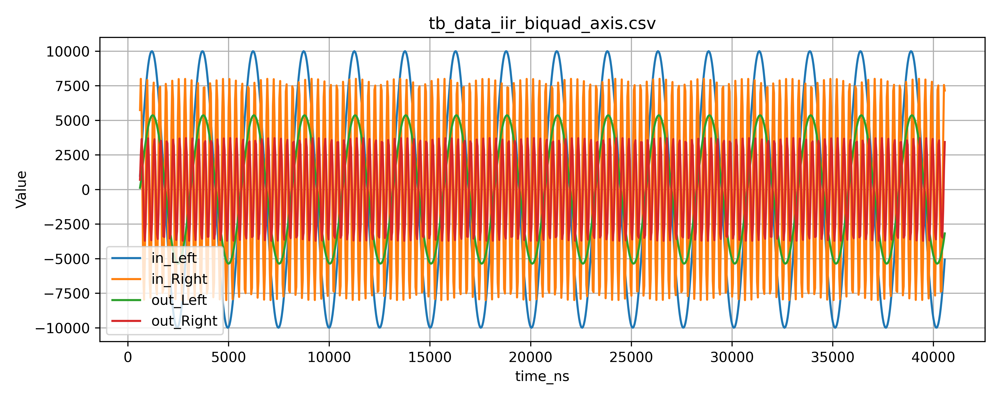

# Results — IIR Biquad Verification

This document summarizes the **simulation results** obtained from the RTL verification of the **IIR Biquad** implementation, covering both:

* **Core-only (mono) verification**, and
* **AXI-Stream + AXI-Lite wrapper (stereo) verification**.

All plots shown here are generated **directly from internal simulation artifacts** (CSV → plot) and reflect the **actual RTL behavior**.

---

## 1. Testbench Overview

Two independent testbenches were used:

1. **`tb_iir_biquad_core`**
   Verifies the *pure DSP core* without AXI interfaces.

2. **`tb_iir_biquad_axis`**
   Verifies the *full AXI-integrated system*, including:

   * AXI-Lite coefficient programming
   * AXI-Stream stereo dataflow
   * Backpressure-aware handshake

Both testbenches use **synthetic audio-like stimuli** composed of low- and high-frequency sinusoidal components.

---

## 2. Core-Level Results (Mono Biquad)

**File:** `tb_data_iir_biquad_core.csv`
**Plot:** `tb_data_iir_biquad_core.png`

### Observations

* The input signal (`x_in`) is a **composite waveform** containing:

  * A strong low-frequency component
  * A higher-frequency component

* The output signal (`y_out`) shows:

  * Clear **attenuation of the higher-frequency content**
  * Preservation of the low-frequency envelope

* After the runtime coefficient switch:

  * The output amplitude collapses significantly
  * This confirms that the **high-pass–like configuration suppresses low-frequency energy**

### Key Takeaways

* The difference equation is implemented correctly
* Fixed-point scaling and saturation behave as expected
* The core remains **stable** during coefficient changes
* No limit-cycle oscillation is observed (helped by light damping logic)

---

## 3. AXI-Integrated Results (Stereo Biquad)

**File:** `tb_data_iir_biquad_axis.csv`
**Plot:** `tb_data_iir_biquad_axis.png`

### Signal Mapping

* **Left Channel**
  Input: low-frequency dominant (bass-like)

* **Right Channel**
  Input: high-frequency dominant (treble-like)

Both channels use **identical biquad coefficients**.

### Observations

* The AXI-Stream output shows:

  * Proper filtering on **both channels simultaneously**
  * No channel crosstalk

* The output waveforms:

  * Are time-aligned with AXI transactions
  * Respect `tvalid/tready` handshaking

* The amplitude reduction and smoothing behavior match the **core-only simulation**, confirming:

  > The AXI wrapper introduces **no unintended arithmetic or timing side effects**.

### AXI-Specific Validation Points

* Coefficients programmed via **AXI-Lite** take effect correctly
* Internal soft-reset clears filter state as intended
* Backpressure handling does not corrupt sample order or data integrity

---

## 4. Latency & Timing Notes

* **Core latency:** 1 clock cycle
* **AXI wrapper latency:** 0 additional cycles
* **Total end-to-end latency:** deterministic and fixed

All plots reflect this behavior implicitly via consistent phase alignment.

---

## 5. Conclusion

These results demonstrate that:

* The IIR biquad core is **functionally correct and numerically stable**
* Fixed-point arithmetic choices are appropriate for audio-range signals
* AXI-Lite and AXI-Stream integration is clean and deterministic
* The module behaves as a **reliable DSP building block**, suitable for:

  * Audio filtering
  * Equalizer stages
  * Larger DSP pipelines on FPGA

> This verification focuses on **design correctness**, not parameter exploration.

---

## 6. Reproducibility

All plots were generated from CSV logs produced directly by RTL simulation.
No post-processing or external modeling assumptions were applied beyond visualization.

This repository is considered **complete** with respect to its stated scope.
